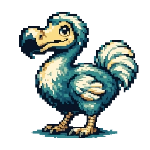

## draft



### commands
- help
- new (check name availability)
    - --name -n "\<name string\>"
    - --desc -d "\<description string\>"
    - --tags -t "\<key words\>"
- remove / rm
    - "\<name\>"
- done
    - "\<name\>"
- list / ls (lists latest 20 or 50 tasks)
    - --filter -f (filter "dsl" goes here)
    - --search -s (searches supplied folder, i.e looks for the "dodos" folder inside given path)

### structure
- todos are local to the folder you are standing in when executing commands
- todo named root folder of a todo task is **YYYY-MM-DD** format
    - inside is a file per task
        - formatted according to:
            - **name=the name**
            - **desc=some description here** (optional)
            - **tags=key,words,goes,here** (optional)
        - priority tags are simply part of tags field
    - searchable on date, name, description, tags
        - filters will be composable
        - i.e ((this and that) and not thing) or other
    - done tasks are in done folder inside the **YYYY-MM-DD** folder
    - **example folder structure**
        - dodos (gives the todos a root path to not collide with any other folders which may use the same naming)
            - 2026-06-23 (folder)
                - update_readme (name of file)
                - ```
                    name=update_readme
                    desc=update the readme with some examples
                    tags=low,readme,examples
                - done (folder)
                    - create_repo (name of done file)
